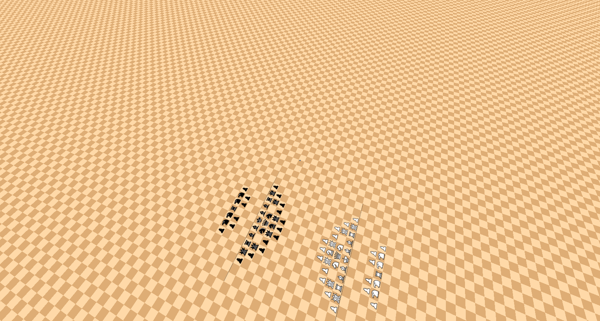

# Infinite Chess Scanner

Reads the position off a screenshot or photo of an [Infinite Chess](https://www.infinitechess.org/)
board and writes it as ICN, ready to paste back into the site.

[](LICENSE)

## Features

- **Any theme, any zoom**: finds the square grid from the board's own tiles, to a fraction of a
  pixel. No calibration, no cropping to exact squares.
- **Perspective mode**: reads boards seen at an angle too, at any tilt and turn, by fitting the
  board's projection from its checkerboard corners.
- **Automatic board regions**: finds the board within a browser window or a photo of a screen. Menus
  and other opaque objects can leave holes, irregular outlines or disconnected visible regions;
  covered squares are excluded from the reading.
- **Every piece**: all 21 piece types and voids, for white, black and neutral, plus the red, blue,
  yellow and green players.
- **Pixel-exact matching**: renders each sprite the way the site's WebGL does, so pieces that differ
  by a couple of pixels, like the queen and royal queen, are still told apart.
- **Highlights and checks**: a square's background is fitted rather than assumed, so move highlights
  don't get in the way, and the red glow of a royal in check marks it as royal.
- **Promotion lines and world borders**: read wherever they show, and written into the ICN.
- **Fast screenshots**: usually a few hundred milliseconds for a direct screenshot. Photos can take
  several seconds. Several images can be read at once across every core.

## Quick Start

Needs [Node.js](https://nodejs.org/) 18.17 or newer.

```bash
git clone https://github.com/FirePlank/infinite-chess-scanner.git
cd infinite-chess-scanner
npm install
node dist/cli.js screenshot.png
```

`npm install` also builds the scanner into `dist/`. Run `npm link` once to use it anywhere as
`infinite-chess-scanner screenshot.png`.

---

## Usage

### Command Line

```bash
node dist/cli.js [--black] [--verbose] <image...>
```

| Option          | Effect                                                                   |
| --------------- | ------------------------------------------------------------------------ |
| `-b, --black`   | The screenshots show the board from black's side, which the site rotates |
| `-v, --verbose` | Also print each screenshot's square size and the area it shows to stderr |

It prints one ICN per screenshot. Given several, each line starts with its file name. Any screenshot
that can't be read prints why to stderr and sets the exit code to 1.

### JavaScript API

```javascript
import { readScreenshot } from 'infinite-chess-scanner';

const reading = await readScreenshot('screenshot.png'); // A file path or a Buffer
// await readScreenshot('screenshot.png', { perspective: 'black' });

reading.icn; //         'w 1 (8|1) r1,8|n2,8|b3,8|...'
reading.pieces; //      [{ abbreviation: 'r', x: 1, y: 8 }, ...]
reading.promotion; //   { white: [8], black: [1] }, or undefined
reading.worldBorder; // { left, right, bottom, top }, null on open sides, or undefined
reading.shown; //       Set { '-10,12', ... }, every fully visible board square read
reading.area; //        { left: -10, right: 19, bottom: -3, top: 12 }, bounding box including border exterior
reading.squareSize; //  50.53, in pixels, of the largest square
reading.perspective; // false, or true when the board is seen at an angle
```

Install it into another project with `npm install github:FirePlank/infinite-chess-scanner`.

## Examples

### Classical


```
w 1 (8|1) r1,8|n2,8|b3,8|q4,8|k5,8|b6,8|n7,8|r8,8|p1,7|p2,7|p3,7|p4,7|p5,7|p6,7|p7,7|p8,7|P1,2|P2,2|P3,2|P4,2|P5,2|P6,2|P7,2|P8,2|R1,1|N2,1|B3,1|Q4,1|K5,1|B6,1|N7,1|R8,1
```

A screenshot can't reveal the board's original coordinates. The scanner places the leftmost piece on
file 1 or 2, choosing the shift that preserves the colors of its squares. When exactly one promotion
rank is read for each side, Black's rank becomes Y=1. Here the white king lands on `5,1`, with every
piece in the right place relative to the others.

### Royals in Check


```
w 1 (8|1) ze53,21|ze54,21|nr33,20|ze56,20|ha14,19|ha15,19|nr31,19|HU37,19|nr43,19|ze59,19|ze62,19|ze64,19|ha15,18|HU39,18|nr43,18|nr44,18|CA6,17|ha16,17|ha17,17|nr22,17|nr27,17|nr28,17|ar36,17|HU39,17|nr48,17|CA4,16|CA5,16|CA6,16|CA8,16|GI20,16|ar31,16|ar32,16|nr48,16|nr49,16|nr50,16|nr53,16|nr54,16|CA3,15|hu24,15|vo61,15|CA10,14|R16,14|GI19,14|ar27,14|RQ41,14|ZE57,14|vo62,14|vo63,14|GI19,13|HA38,13|vo44,13|ob51,13|ZE57,13|vo64,13|vo65,13|ce12,12|GI17,12|R21,12|HA33,12|ob51,12|vo65,12|NR4,11|ca10,11|rq22,11|p35,11|p36,11|p37,11|p38,11|ZE42,11|gi48,11|am14,10|rq20,10|ar25,10|p26,10|p28,10|p45,10|p47,10|ro55,10|ro56,10|rq19,9|p27,9|p46,9|ro56,9|ro57,9|ca7,8|am11,8|ce17,8|RQ27,8|r33,8|n34,8|b35,8|q36,8|k37,8|b38,8|n39,8|r40,8|gi48,8|ob52,8|HA63,8|ca7,7|ar21,7|HA22,7|HA30,7|n32,7|p33,7|p34,7|p35,7|p36,7|p37,7|p38,7|p39,7|p40,7|n41,7|gi48,7|HA63,7|HA64,7|NR4,6|ca7,6|CA15,6|gi48,6|ha58,6|vo68,6|ca6,5|ob10,5|ob11,5|HA26,5|HA27,5|gu34,5|gu35,5|gu37,5|gu46,5|gu50,5|vo68,5|ob10,4|CA15,4|ar18,4|HA23,4|gu31,4|gu50,4|gu53,4|ha58,4|HA64,4|vo68,4|ar2,3|ob9,3|ce20,3|HA64,3|ar4,2|ob8,2|vo12,2|CA15,2|CA16,2|ce20,2|ce23,2|ce27,2|N32,2|P33,2|P34,2|P35,2|P36,2|P37,2|P38,2|P39,2|P40,2|N41,2|HA64,2|ob8,1|vo12,1|CA16,1|R33,1|N34,1|B35,1|Q36,1|K37,1|B38,1|N39,1|R40,1|ha55,1|HA64,1|ob8,0|vo12,0|RQ20,0|RQ21,0|ce27,0|P46,0|NR4,-1|ob7,-1|RO9,-1|vo13,-1|RQ21,-1|P26,-1|P28,-1|P45,-1|P47,-1|ha52,-1|ob7,-2|vo13,-2|HA19,-2|GU31,-2|P35,-2|P36,-2|P37,-2|P38,-2|nr46,-2|ob7,-3|RO10,-3|vo13,-3|HA19,-3|am42,-3|p56,-3|p57,-3|RO2,-4|ob7,-4|vo13,-4|vo14,-4|HA19,-4|HA20,-4|ob23,-4|GU27,-4|ob50,-4|vo14,-5|vo15,-5|vo16,-5|gu22,-5|ce36,-5|nr47,-5|p58,-5|ce31,-6|GU44,-6|nr47,-6|nr51,-6|nr54,-6|NR5,-7|NR20,-7|ob41,-7|p60,-7|RO3,-8|NR8,-8|CA12,-8|CA16,-8|CA18,-8|gu24,-8|RO27,-8|ob38,-8|ob39,-8|RO27,-9|GU45,-9|p62,-9|CA20,-10|GU48,-10|GU52,-10|p63,-10|p64,-10|NR11,-11|NR14,-11|NR15,-11|gu24,-11|RO31,-12|RO38,-12|RO39,-12
```

The royal queens glowing red come out as `RQ` and `rq`, while the white queen on `36,1` stays a
plain `Q`.

### World Border


```
w 1 1,8,-3,4 r1,4|n2,4|b3,4|q4,4|k5,4|b6,4|n7,4|r8,4|p1,3|p2,3|p3,3|p4,3|p5,3|p6,3|p7,3|p8,3|P1,-2|P2,-2|P3,-2|P4,-2|P5,-2|P6,-2|P7,-2|P8,-2|R1,-3|N2,-3|B3,-3|Q4,-3|K5,-3|B6,-3|N7,-3|R8,-3
```

The board ends inside the screenshot on every side, so the world border `1,8,-3,4` is read too. No
promotion pair is detected here, so Y stays relative to the visible board's center.

### Perspective



```
w 1 (13|1) p4,17|ha5,17|ha6,17|r7,17|ha8,17|ha9,17|p10,17|p5,16|p6,16|p8,16|p9,16|p2,13|gu3,13|r4,13|b5,13|b6,13|k7,13|b8,13|b9,13|r10,13|gu11,13|p12,13|p3,12|gu4,12|n6,12|q7,12|n8,12|gu10,12|p11,12|p4,11|p5,11|gu6,11|ch7,11|gu8,11|p9,11|p10,11|p6,10|p7,10|p8,10|P6,4|P7,4|P8,4|P4,3|P5,3|GU6,3|CH7,3|GU8,3|P9,3|P10,3|P3,2|GU4,2|N6,2|Q7,2|N8,2|GU10,2|P11,2|P2,1|GU3,1|R4,1|B5,1|B6,1|K7,1|B8,1|B9,1|R10,1|GU11,1|P12,1|P5,-2|P6,-2|P8,-2|P9,-2|P4,-3|HA5,-3|HA6,-3|R7,-3|HA8,-3|HA9,-3|P10,-3
```

All 78 pieces of Abundance and both promotion lines, read at a grazing angle with the board turned
sideways, the farthest on squares about 15 pixels across. Black's promotion rank stays at Y=1 even
though some pieces extend below it.

## Taking a Screenshot or Photo

- The board can occupy part of the image. Keep enough exposed checkerboard to identify its grid; the
  scanner detects the board automatically around menus and bars.
- Zoom so squares are at least 7 pixels wide. Larger is safer.
- Save screenshots as PNG when possible. JPEG photos are supported, but heavy compression, blur and
  glare can hide the details needed to distinguish pieces.

## Limitations

- **Coordinate anchors**: every piece has X≥1; the leftmost piece is on file 1 or 2, preserving even
  x+y on dark squares. Exactly one detected promotion rank per side anchors Black's rank at Y=1,
  even when pieces extend below it. Otherwise Y stays relative to the visible board's center. These
  shifts also apply to promotion ranks, world borders, `reading.shown` and `reading.area`; empty
  squares can still have negative coordinates. Original board coordinates can't be known from the
  image, but the pieces' positions relative to each other are preserved.
- **Hidden state**: special rights, whose turn it is, the move rule and clocks don't show on the
  board. The ICN says white to move on move 1, with no special rights.
- **Promotion**: read only when both sides' lines show, with the upper half of the lines taken as
  white's (black's with `--black`). Zoomed far out the site may draw just one line, and then no
  promotion is written. Which pieces pawns may promote to never shows, so the site's default is
  implied.
- **World borders**: read only on sides where the board ends inside the screenshot. A full row or
  column of voids along the screenshot's edge also looks like the board ending there.
- **Squares under 6.5 pixels** are refused rather than guessed. In perspective mode that's measured
  across a square's narrower side, so the far part of the board is left unread, and only the squares
  in `reading.shown` say anything about the position.
- **Occlusion**: squares covered by opaque menus or foreground objects are excluded from
  `reading.shown`, including partially covered squares. Pieces hidden there are not reconstructed.
- **What's drawn over the board**: arrows, annotations and legal move dots aren't understood, and
  can throw off the squares under them. Move highlights are fine.
- **Black's side** must be asked for with `--black`. Without it, the position reads rotated 180°.
- **Other players**: red, blue, yellow and green pieces are supported, but untested on real
  screenshots.
- **Piece set**: matches the site's sprites as of this version, bundled in `assets/pieces/`. If the
  site changes them, update those files.

## Testing

```bash
npm test
```

Reads 49 screenshots and photos of the site and checks each against the true position up to
translation: pieces, voids, promotion ranks and world border. They cover the 18 standard variants,
zoom levels down to 7-pixel squares, two board themes, royals in check, black's side, perspective
mode at several tilts and turns, browser windows, and photos with menus covering part of the board.
Five synthetic images check embedded boards, menus matching a tile color, partially covered pieces,
disconnected visible regions, and an irregular outline at the image boundary. One more fixture,
zoomed out too far, must be refused.

---

## License

This project is licensed under the GNU Affero General Public License v3.0 - see [LICENSE](LICENSE)
for details. The piece sprites in `assets/pieces/` are from
[infinitechess.org](https://github.com/Infinite-Chess/infinitechess.org), under the same license.

## Links

- [Infinite Chess](https://www.infinitechess.org/) - Play infinite chess online
- [infinitechess.org on GitHub](https://github.com/Infinite-Chess/infinitechess.org) - The site's
  source, including the ICN format
