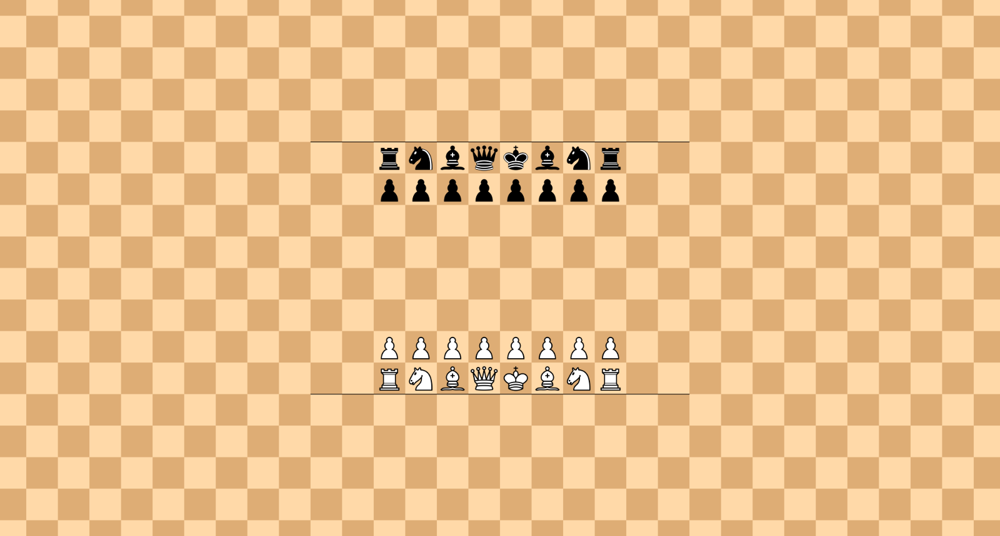
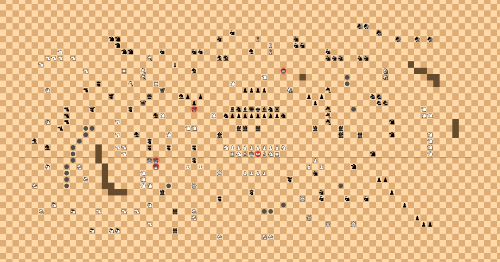
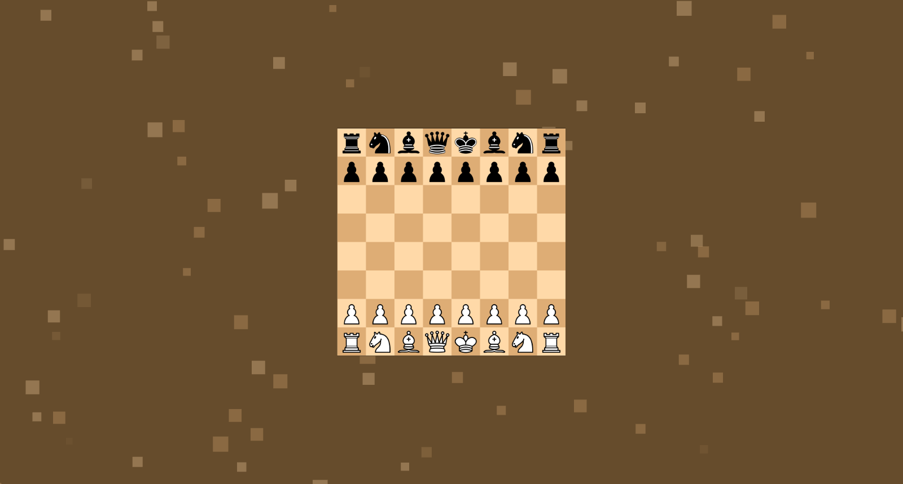

# Infinite Chess Scanner

Reads the position off a screenshot of an [Infinite Chess](https://www.infinitechess.org/) board and
writes it as ICN, ready to paste back into the site.

[](LICENSE)

## Features

- **Any theme, any zoom**: finds the square grid from the board's own tiles, to a fraction of a
  pixel. No calibration, no cropping to exact squares.
- **Every piece**: all 21 piece types and voids, for white, black and neutral, plus the red, blue,
  yellow and green players.
- **Pixel-exact matching**: renders each sprite the way the site's WebGL does, so pieces that differ
  by a couple of pixels, like the queen and royal queen, are still told apart.
- **Highlights and checks**: a square's background is fitted rather than assumed, so move highlights
  don't get in the way, and the red glow of a royal in check marks it as royal.
- **Promotion lines and world borders**: read wherever they show, and written into the ICN.

## Quick Start

Needs [Node.js](https://nodejs.org/) 18.17 or newer.

```bash
git clone https://github.com/FirePlank/infinite-chess-scanner.git
cd infinite-chess-scanner
npm install
node dist/cli.js screenshot.png
```

`npm install` also builds the scanner into `dist/`. Run `npm link` once to use it anywhere as
`infinite-chess-scanner screenshot.png`.

---

## Usage

### Command Line

```bash
node dist/cli.js [--black] [--verbose] <image...>
```

| Option          | Effect                                                                   |
| --------------- | ------------------------------------------------------------------------ |
| `-b, --black`   | The screenshots show the board from black's side, which the site rotates |
| `-v, --verbose` | Also print each screenshot's square size and the area it shows to stderr |

It prints one ICN per screenshot. Given several, each line starts with its file name. Any screenshot
that can't be read prints why to stderr and sets the exit code to 1.

### JavaScript API

```javascript
import { readScreenshot } from 'infinite-chess-scanner';

const reading = await readScreenshot('screenshot.png'); // A file path or a Buffer
// await readScreenshot('screenshot.png', { perspective: 'black' });

reading.icn; //         'w 1 (4|-3) r-3,4|n-2,4|b-1,4|...'
reading.pieces; //      [{ abbreviation: 'r', x: -3, y: 4 }, ...]
reading.promotion; //   { white: [4], black: [-3] }, or undefined
reading.worldBorder; // { left, right, bottom, top }, null on open sides, or undefined
reading.area; //        { left: -14, right: 15, bottom: -7, top: 8 }, the squares it fully shows
reading.squareSize; //  50.53, in pixels
```

Install it into another project with `npm install github:FirePlank/infinite-chess-scanner`.

## Examples

### Classical



```
w 1 (4|-3) r-3,4|n-2,4|b-1,4|q0,4|k1,4|b2,4|n3,4|r4,4|p-3,3|p-2,3|p-1,3|p0,3|p1,3|p2,3|p3,3|p4,3|P-3,-2|P-2,-2|P-1,-2|P0,-2|P1,-2|P2,-2|P3,-2|P4,-2|R-3,-3|N-2,-3|B-1,-3|Q0,-3|K1,-3|B2,-3|N3,-3|R4,-3
```

A screenshot can't tell where on the infinite board it is, so the middle square of the screenshot
becomes 0,0. Here that puts the white king on `1,-3` rather than `5,1`, with every piece in the
right place relative to the others.

### Royals in Check



```
w 1 (4|-3) ze17,17|ze18,17|nr-3,16|ze20,16|ha-22,15|ha-21,15|nr-5,15|HU1,15|nr7,15|ze23,15|ze26,15|ze28,15|ha-21,14|HU3,14|nr7,14|nr8,14|CA-30,13|ha-20,13|ha-19,13|nr-14,13|nr-9,13|nr-8,13|ar0,13|HU3,13|nr12,13|CA-32,12|CA-31,12|CA-30,12|CA-28,12|GI-16,12|ar-5,12|ar-4,12|nr12,12|nr13,12|nr14,12|nr17,12|nr18,12|CA-33,11|hu-12,11|vo25,11|CA-26,10|R-20,10|GI-17,10|ar-9,10|RQ5,10|ZE21,10|vo26,10|vo27,10|GI-17,9|HA2,9|vo8,9|ob15,9|ZE21,9|vo28,9|vo29,9|ce-24,8|GI-19,8|R-15,8|HA-3,8|ob15,8|vo29,8|NR-32,7|ca-26,7|rq-14,7|p-1,7|p0,7|p1,7|p2,7|ZE6,7|gi12,7|am-22,6|rq-16,6|ar-11,6|p-10,6|p-8,6|p9,6|p11,6|ro19,6|ro20,6|rq-17,5|p-9,5|p10,5|ro20,5|ro21,5|ca-29,4|am-25,4|ce-19,4|RQ-9,4|r-3,4|n-2,4|b-1,4|q0,4|k1,4|b2,4|n3,4|r4,4|gi12,4|ob16,4|HA27,4|ca-29,3|ar-15,3|HA-14,3|HA-6,3|n-4,3|p-3,3|p-2,3|p-1,3|p0,3|p1,3|p2,3|p3,3|p4,3|n5,3|gi12,3|HA27,3|HA28,3|NR-32,2|ca-29,2|CA-21,2|gi12,2|ha22,2|vo32,2|ca-30,1|ob-26,1|ob-25,1|HA-10,1|HA-9,1|gu-2,1|gu-1,1|gu1,1|gu10,1|gu14,1|vo32,1|ob-26,0|CA-21,0|ar-18,0|HA-13,0|gu-5,0|gu14,0|gu17,0|ha22,0|HA28,0|vo32,0|ar-34,-1|ob-27,-1|ce-16,-1|HA28,-1|ar-32,-2|ob-28,-2|vo-24,-2|CA-21,-2|CA-20,-2|ce-16,-2|ce-13,-2|ce-9,-2|N-4,-2|P-3,-2|P-2,-2|P-1,-2|P0,-2|P1,-2|P2,-2|P3,-2|P4,-2|N5,-2|HA28,-2|ob-28,-3|vo-24,-3|CA-20,-3|R-3,-3|N-2,-3|B-1,-3|Q0,-3|K1,-3|B2,-3|N3,-3|R4,-3|ha19,-3|HA28,-3|ob-28,-4|vo-24,-4|RQ-16,-4|RQ-15,-4|ce-9,-4|P10,-4|NR-32,-5|ob-29,-5|RO-27,-5|vo-23,-5|RQ-15,-5|P-10,-5|P-8,-5|P9,-5|P11,-5|ha16,-5|ob-29,-6|vo-23,-6|HA-17,-6|GU-5,-6|P-1,-6|P0,-6|P1,-6|P2,-6|nr10,-6|ob-29,-7|RO-26,-7|vo-23,-7|HA-17,-7|am6,-7|p20,-7|p21,-7|RO-34,-8|ob-29,-8|vo-23,-8|vo-22,-8|HA-17,-8|HA-16,-8|ob-13,-8|GU-9,-8|ob14,-8|vo-22,-9|vo-21,-9|vo-20,-9|gu-14,-9|ce0,-9|nr11,-9|p22,-9|ce-5,-10|GU8,-10|nr11,-10|nr15,-10|nr18,-10|NR-31,-11|NR-16,-11|ob5,-11|p24,-11|RO-33,-12|NR-28,-12|CA-24,-12|CA-20,-12|CA-18,-12|gu-12,-12|RO-9,-12|ob2,-12|ob3,-12|RO-9,-13|GU9,-13|p26,-13|CA-16,-14|GU12,-14|GU16,-14|p27,-14|p28,-14|NR-25,-15|NR-22,-15|NR-21,-15|gu-12,-15|RO-5,-16|RO2,-16|RO3,-16
```

The royal queens glowing red come out as `RQ` and `rq`, while the white queen on `0,-3` stays a
plain `Q`.

### World Border



```
w 1 -3,4,-3,4 r-3,4|n-2,4|b-1,4|q0,4|k1,4|b2,4|n3,4|r4,4|p-3,3|p-2,3|p-1,3|p0,3|p1,3|p2,3|p3,3|p4,3|P-3,-2|P-2,-2|P-1,-2|P0,-2|P1,-2|P2,-2|P3,-2|P4,-2|R-3,-3|N-2,-3|B-1,-3|Q0,-3|K1,-3|B2,-3|N3,-3|R4,-3
```

The board ends inside the screenshot on every side, so the world border `-3,4,-3,4` is read too.

## Taking a Screenshot

- Crop away the site's menus and bars. Anything covering the board's edge reads as the edge of the
  board.
- Zoom so squares are at least 7 pixels wide. Larger is safer.
- Save as PNG. Heavy JPEG compression blurs pieces into each other.

## Limitations

- **Relative coordinates**: the screenshot's middle square becomes 0,0, nudged so that dark squares
  have an even x+y as on the site. The real coordinates can't be known.
- **Hidden state**: special rights, whose turn it is, the move rule and clocks don't show on the
  board. The ICN says white to move on move 1, with no special rights.
- **Promotion**: read only when both sides' lines show, with the upper half of the lines taken as
  white's (black's with `--black`). Zoomed far out the site may draw just one line, and then no
  promotion is written. Which pieces pawns may promote to never shows, so the site's default is
  implied.
- **World borders**: read only on sides where the board ends inside the screenshot. A full row or
  column of voids along the screenshot's edge also looks like the board ending there.
- **Squares under 6.5 pixels** are refused rather than guessed.
- **What's drawn over the board**: arrows, annotations and legal move dots aren't understood, and
  can throw off the squares under them. Move highlights are fine.
- **Black's side** must be asked for with `--black`. Without it, the position reads rotated 180°.
- **Other players**: red, blue, yellow and green pieces are supported, but untested on real
  screenshots.
- **Piece set**: matches the site's sprites as of this version, bundled in `assets/pieces/`. If the
  site changes them, update those files.

## Testing

```bash
npm test
```

Reads 30 screenshots of the site and checks each against the true position up to translation:
pieces, voids, promotion ranks and world border. They cover the 18 standard variants, zoom levels
down to 7-pixel squares, two board themes, royals in check and black's side. One more, zoomed out
too far, must be refused.

---

## License

This project is licensed under the GNU Affero General Public License v3.0 - see [LICENSE](LICENSE)
for details. The piece sprites in `assets/pieces/` are from
[infinitechess.org](https://github.com/Infinite-Chess/infinitechess.org), under the same license.

## Links

- [Infinite Chess](https://www.infinitechess.org/) - Play infinite chess online
- [infinitechess.org on GitHub](https://github.com/Infinite-Chess/infinitechess.org) - The site's
  source, including the ICN format
